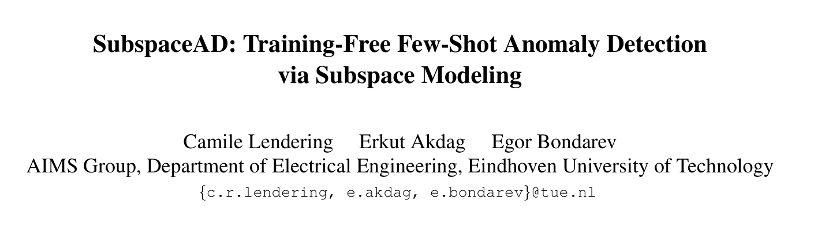
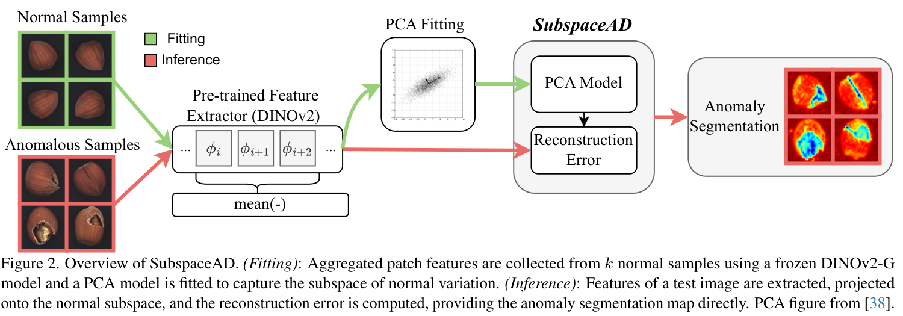
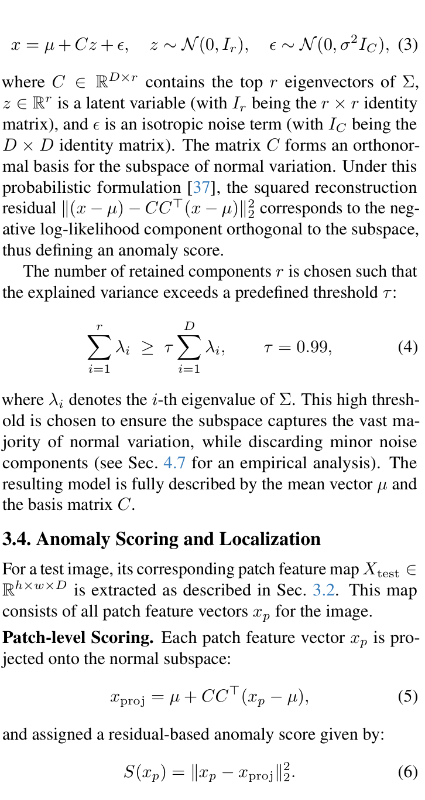
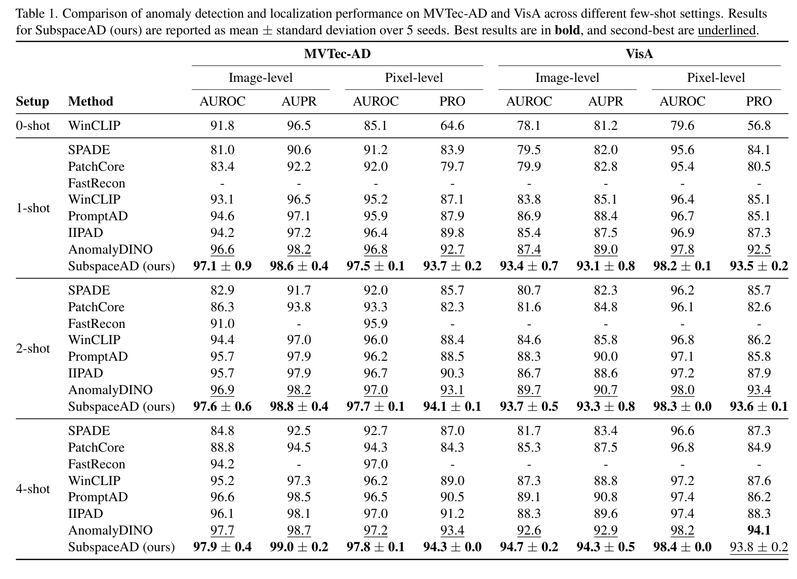
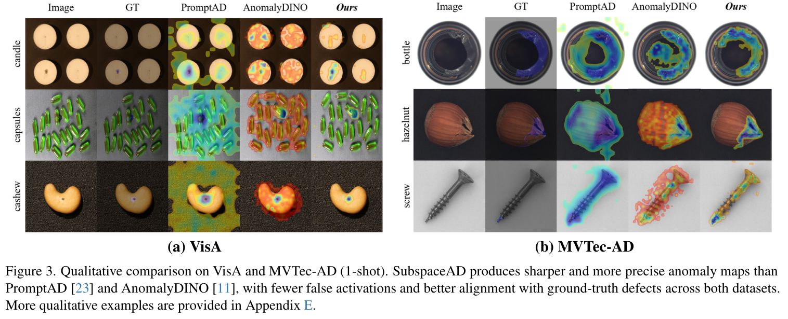
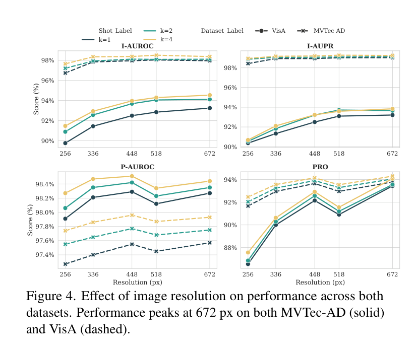
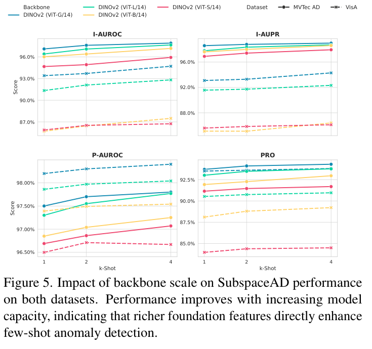
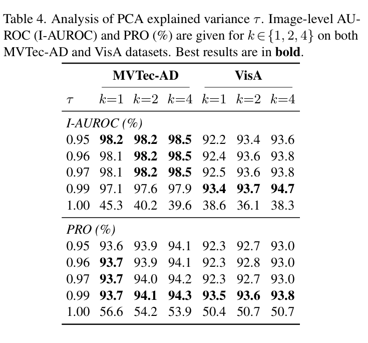

# SubspaceAD：通过子空间建模实现免训练少样本异常检测

- 作者：Camile Lendering, Erkut Akdag, Egor Bondarev
- 学校：埃因霍温理工大学电气工程系 AIMS Group
- 关键词：少样本异常检测；免训练；子空间建模；主成分分析；DINOv2；工业视觉检测
- DOI / 论文链接：https://arxiv.org/abs/2602.23013

## 1. 研究背景、问题定义与核心思路
### 1.1 研究动机与关键挑战

这篇论文面向工业视觉检测中的少样本异常检测问题。工业场景中，正常样本通常比异常样本更容易获得，但每个类别也未必能提供大量无缺陷图片；同时，异常可能只是微小划痕、污染、缺失部件或结构错位，无法只靠语义文本提示稳定描述。现有少样本方法虽然性能较强，但往往引入 memory bank、提示调优、辅助数据、复杂训练目标或多阶段推理流程。

论文的出发点是一个朴素但关键的问题：如果 DINOv2 这类视觉基础模型已经能给出足够强的 patch-level 表征，那么异常检测是否还需要复杂训练和大规模特征库？作者的回答是否定的。他们用 PCA 对少量正常图像的 patch 特征做低维正常子空间建模，再用测试 patch 到该子空间的重构残差作为异常分数。

### 1.2 方法框架与核心思路

SubspaceAD 的输入是 $k \in \{1,2,4\}$ 张无异常训练图像 $I_{\mathrm{train}}=\{I_1,\ldots,I_k\}$ 和测试图像 $I_{\mathrm{test}}$，目标是在测试图像每个空间位置 $p$ 上输出异常似然：

$$
A(I_{\mathrm{test}},p)\in[0,1].
$$

方法分为两个阶段。第一阶段用冻结的 DINOv2-G 提取正常图像的 patch token，并对中间层特征做均值聚合：

$$
x_p=\frac{1}{|\mathcal{L}|}\sum_{l\in\mathcal{L}} f_l(p),
$$

其中 $f_l(p)\in\mathbb{R}^D$ 是第 $l$ 个 Transformer block 在位置 $p$ 的 patch token，$\mathcal{L}$ 在论文实验中取 DINOv2-G 的 22-28 层。第二阶段对所有正常 patch 特征 $X_{\mathrm{normal}}$ 拟合 PCA，得到正常变化的低维线性子空间。测试时，将每个 patch 特征投影到该正常子空间，重构误差越大，异常分数越高。

这张框架图说明了方法的最小闭环：正常样本经冻结特征提取器得到 patch 表征，PCA 拟合正常子空间；测试样本走同一个特征提取器，然后通过 PCA 重构误差直接生成异常分割图。它也是本文“免训练、无 memory bank、无 prompt tuning”主张的结构性依据。

### 1.3 主要创新点

**创新点 1：用 PCA 替代复杂少样本异常检测管线。** 论文没有训练重构网络，也不保存大规模 patch memory bank，而是用 PCA 的闭式解估计正常特征子空间。这使模型只需保存均值向量 $\mu$ 和子空间基 $C$。

**创新点 2：把强视觉基础特征与经典统计建模重新结合。** 方法的性能主要来自 DINOv2-G 的密集表征能力，而异常判别由 PCA 残差完成。论文展示的是“基础模型特征 + 简单统计模型”在少样本工业异常检测中的可行性。

**创新点 3：同时覆盖检测、定位和消融验证。** 作者在 MVTec-AD 与 VisA 上报告图像级 AUROC/AUPR、像素级 AUROC/PRO，并分析输入分辨率、层聚合、backbone 规模和 PCA 解释方差阈值的影响。

## 2. 核心方法与技术主线解析
### 2.1 整体技术路线

SubspaceAD 的技术主线可以概括为四步：特征抽取、正常子空间拟合、残差评分、图像级与像素级输出。

第一，冻结 DINOv2-G，提取每张图的 patch token。论文没有只用最后一层，而是对中间 7 层做 mean-pooling，因为中间层更能兼顾结构细节和语义信息。第二，对 $k$ 张正常图像及其旋转增强样本提取全部 patch 特征，组成 $X_{\mathrm{normal}}$，并计算均值 $\mu$ 与协方差 $\Sigma$。第三，PCA 取 $\Sigma$ 的前 $r$ 个特征向量作为 $C\in\mathbb{R}^{D\times r}$。第四，测试 patch 特征 $x_p$ 被投影到该子空间，残差平方作为异常分数。

核心概率模型写作：

$$
x=\mu+Cz+\epsilon,\quad z\sim\mathcal{N}(0,I_r),\quad \epsilon\sim\mathcal{N}(0,\sigma^2 I_C).
$$

保留主成分数量 $r$ 由解释方差阈值决定：

$$
\sum_{i=1}^{r}\lambda_i\ge\tau\sum_{i=1}^{D}\lambda_i,\qquad \tau=0.99.
$$

测试 patch 的投影和评分为：

$$
x_{\mathrm{proj}}=\mu+CC^\top(x_p-\mu),
$$

$$
S(x_p)=\lVert x_p-x_{\mathrm{proj}}\rVert_2^2.
$$

图像级分数采用 tail value-at-risk，只平均异常图中最高的 $\rho=1\%$ patch 分数：

$$
s_{\mathrm{img}}=\operatorname{mean}\bigl(H_{\rho}(M)\bigr).
$$

### 2.2 关键技术块解析

**PCA 子空间块。** 这个技术块定义了正常 patch 特征的低维生成形式：正常特征应主要落在 $\mu+Cz$ 张成的线性子空间附近，而 $\epsilon$ 表示各向同性噪声。它的作用不是训练一个生成模型，而是给出一个闭式、参数轻量的正常变化估计。异常 patch 的关键特征是不能被这个主子空间充分重构，因此会在正交残差方向留下较大能量。

**解释方差阈值块。** 阈值 $\tau=0.99$ 控制保留多少主成分。它不是越大越好：如果 $\tau=1.00$，模型几乎保留完整特征空间，异常也可能被重构掉，残差分数反而失效。这个设定把“正常主变化”和“小幅噪声/异常残差”分离开，是方法能工作的关键。

**投影残差评分块。** $x_{\mathrm{proj}}$ 是测试 patch 在正常子空间上的重构，$S(x_p)$ 是原始特征与重构特征的欧氏距离平方。该分数具有直观解释：正常 patch 能被少量主成分解释，异常 patch 偏离正常变化方向，因此残差更大。像素级异常图由 patch 分数上采样并高斯平滑得到；图像级分数则用最高 1% patch 分数的均值增强对稀疏缺陷的敏感性。

## 3. 实验结果与对比分析
### 3.1 实验设置与对比对象

论文在 MVTec-AD 和 VisA 两个工业异常检测基准上评估 SubspaceAD。MVTec-AD 包含 15 个类别，VisA 的图像分辨率更高、异常类型更复杂。评估指标包括图像级 AUROC/AUPR，以及像素级 AUROC/PRO。少样本设置为 1-shot、2-shot 和 4-shot，每个设置用 5 个随机种子报告均值和标准差。

对比方法覆盖三类路线：memory-bank 方法，包括 SPADE、PatchCore、AnomalyDINO；重构方法，包括 FastRecon；视觉语言模型方法，包括 WinCLIP、PromptAD、IIPAD。实现上，SubspaceAD 使用冻结 DINOv2-G，输入分辨率统一为 672 px，PCA 阈值 $\tau=0.99$，TVaR 取 $\rho=1\%$。

### 3.2 主要结果与对比说明

**主结果表明 SubspaceAD 在少样本设置下整体领先。** 在 1-shot MVTec-AD 上，SubspaceAD 达到图像级 AUROC 97.1% 和像素级 AUROC 97.5%；在 VisA 上达到图像级 AUROC 93.4% 和像素级 AUROC 98.2%。相较 AnomalyDINO，VisA 1-shot 图像级 AUROC 提升 6.0 个百分点，PRO 提升 1.0 个百分点。4-shot 时，SubspaceAD 在 MVTec-AD 的 PRO 达到 94.3%，在 VisA 的图像级 AUROC 达到 94.7%，但 VisA 的 PRO 略低于 AnomalyDINO 的 94.1%。因此，安全结论是：SubspaceAD 在大多数指标上达到或超过已有少样本方法，但并非每个单项指标都绝对第一。

**定性图证明了残差图的定位能力。** Figure 3 对比了 PromptAD、AnomalyDINO 和 SubspaceAD 的异常热图。SubspaceAD 的预测在 VisA 的 candle/capsules/cashew 和 MVTec-AD 的 bottle/hazelnut/screw 示例中更贴近 GT 区域，背景误激活更少。这说明 PCA 残差并不只是图像级异常指标，也能形成可用的空间定位图。

**分辨率消融说明方法对空间细节有需求，但超过一定阈值后收益趋稳。** Figure 4 显示 VisA 从 256 px 提升到 448/672 px 时性能明显改善，MVTec-AD 在 448 px 以上总体较稳定。论文最终采用 672 px，是为了在两个数据集上取得稳健折中，而不是因为模型必须依赖极高分辨率。

**backbone 规模是性能上限的重要因素。** Figure 5 显示 DINOv2-G/14 整体优于较小的 DINOv2-S/B/L 变体，说明 SubspaceAD 的判别力高度依赖基础模型特征质量。由于 PCA 本身开销很小，部署约束主要来自特征提取器；在边缘部署场景中，小 backbone 可作为性能与速度的折中。

**PCA 阈值不是普通超参数，而是残差空间是否存在的关键开关。** Table 4 显示 $\tau\in[0.95,0.99]$ 时性能较稳定，但 $\tau=1.00$ 时 I-AUROC 和 PRO 大幅下降。这支持论文的核心解释：异常主要体现在正常主子空间之外的残差方向；若保留完整空间，残差判别信号会被削弱。

## 4. 面向不同对象的后续建议
1. 面向入门者
   标题：先掌握“特征空间中的正常子空间”
   *核心建议：* 从 PCA、重构误差、AUROC/PRO 三个概念入手，复现一类数据上的 patch 特征 PCA 可视化，而不是一开始就追复杂异常检测框架。
   数学推导难度：低到中
2. 面向硕博学生
   标题：研究非线性正常流形与鲁棒 PCA
   *核心建议：* 可以把本文线性 PCA 子空间扩展到 kernel PCA、robust PCA 或低秩加稀疏分解，重点验证异常污染、类别内形变和小样本增强策略对残差空间的影响。
   数学推导难度：中到高
3. 面向教授
   标题：把课题范围限定在“基础特征质量与统计模型边界”
   *核心建议：* 指导学生时可将任务拆成特征层选择、子空间估计、异常分数校准和部署成本四个模块，要求每个模块都有独立消融，避免只堆更复杂网络结构。
   数学推导难度：中

## 5. 总结与评价

SubspaceAD 的核心价值在于证明：在 DINOv2 这类强视觉基础特征上，少样本工业异常检测不一定需要训练复杂模型或维护大型 memory bank。PCA 正常子空间提供了一个清晰、可解释、参数轻量的异常判别机制；测试阶段的残差分数既可用于图像级检测，也可上采样形成像素级定位图。

从证据看，论文在 MVTec-AD 和 VisA 的少样本设置中给出了主表、定性图和多组消融，能够支撑“简单统计模型可达到强基线甚至 SOTA 性能”的结论。但其性能上限明显依赖 DINOv2-G 的特征质量，且旋转增强、层聚合和 PCA 阈值仍是关键工程设定。因此，更准确的评价是：SubspaceAD 不是一个完全无假设的方法，而是一个把强表征能力转化为低成本异常检测能力的极简统计框架。
