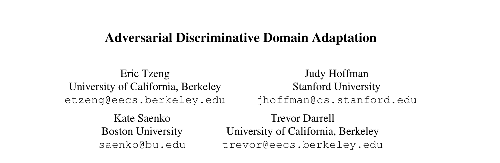
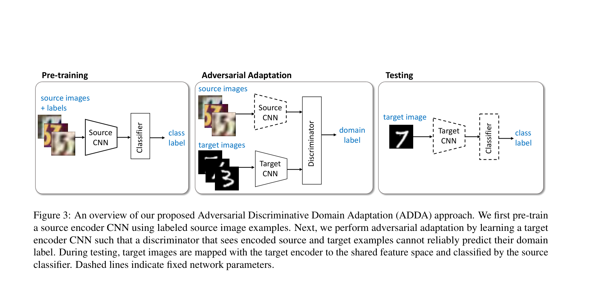
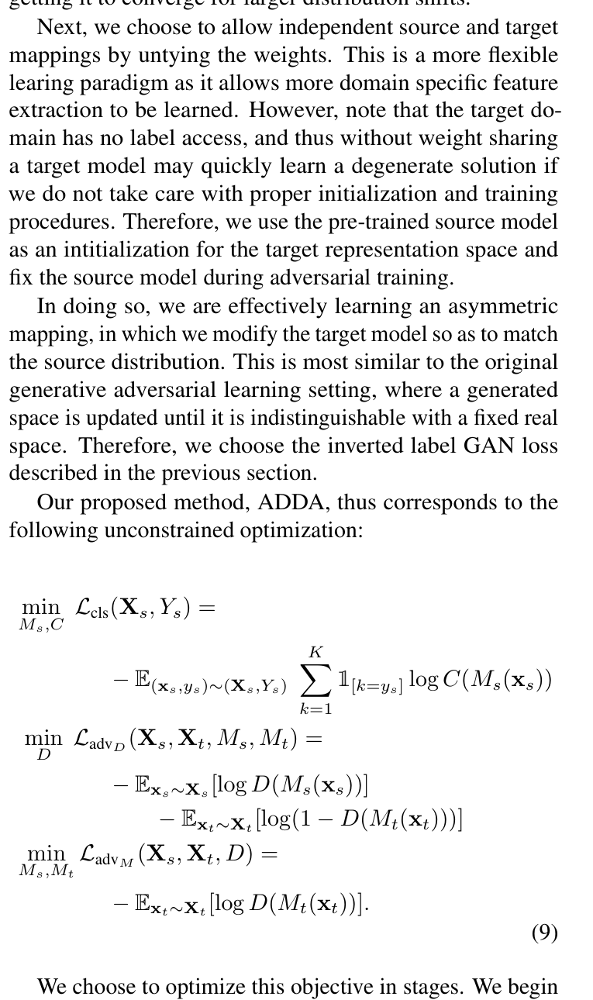
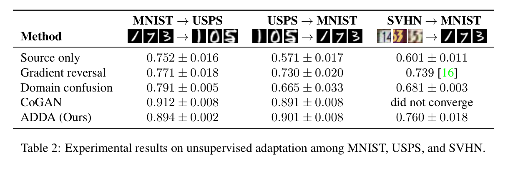
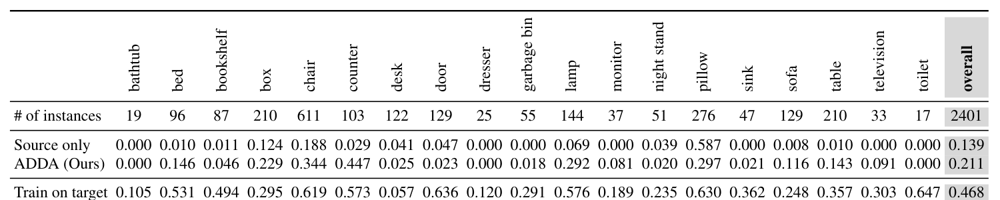
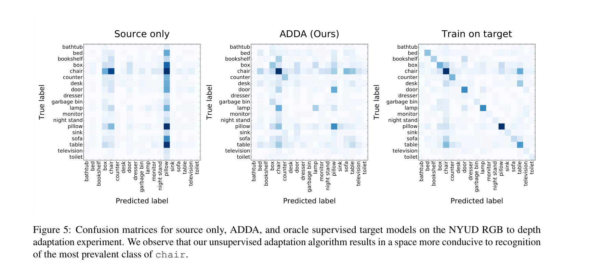

# 对抗判别式域适应

- 作者：Eric Tzeng; Judy Hoffman; Kate Saenko; Trevor Darrell
- 单位：加州大学伯克利分校；斯坦福大学；波士顿大学
- 关键词：无监督域适应；对抗学习；判别式特征；域偏移；GAN loss
- DOI / 论文链接：https://arxiv.org/abs/1702.05464

## 1. 研究背景、问题定义与核心思路
### 1.1 研究动机与关键挑战

这篇论文解决的是**无监督域适应**问题：有带标签的源域样本 $X_s, Y_s$，也有无标签目标域样本 $X_t$，希望模型在目标域上分类。论文的出发点是深度网络在一个数据集上学到的表示，会因为 dataset bias 或 domain shift 在新数据域上泛化变差。

这与工业机器视觉缺陷检测中的问题高度相关：前五款电池有划痕标签，第六款电池暂时没有划痕标签，前五款训练出的划痕分类器或检测器直接迁移到第六款时效果不好。这里的本质不是“划痕类别不存在”，而是产品外观、材质、纹理、光照、相机、工艺背景等因素改变后，**产品域特征子空间**压过了**缺陷语义子空间**。

但论文的前提必须说清楚：ADDA 假设目标域有无标签图像 $X_t$。如果第六款电池连无标签图像都没有，这篇论文的方法无法启动；如果第六款只有正常样本而没有划痕样本，它可以做产品外观域适应，但不能保证划痕子空间被正确对齐。

### 1.2 方法框架与核心思路

论文把域适应写成两个映射的对齐问题：源域编码器 $M_s$ 把源图像映射到源特征空间，目标域编码器 $M_t$ 把目标图像映射到同一个判别式空间。若 $M_s(X_s)$ 与 $M_t(X_t)$ 的分布足够接近，源域分类器 $C_s$ 就可以直接作用在目标域特征上。

核心目标可以概括为：

$$
\min_{M_s, C} \mathcal{L}_{cls}(X_s, Y_s),
$$

$$
\min_D \mathcal{L}_{advD}(X_s, X_t, M_s, M_t)
= -\mathbb{E}_{x_s \sim X_s}[\log D(M_s(x_s))]
- \mathbb{E}_{x_t \sim X_t}[\log(1 - D(M_t(x_t)))]
$$

$$
\min_{M_t} \mathcal{L}_{advM}(X_s, X_t, D)
= -\mathbb{E}_{x_t \sim X_t}[\log D(M_t(x_t))].
$$

换到电池划痕场景：前五款电池可以作为源域，第六款电池作为目标域。源域模型先学“划痕 vs 非划痕”或更细粒度缺陷类别；随后训练目标域编码器，让判别器分不清“前五款特征”和“第六款特征”。理想结果是第六款的表面纹理被拉到已有特征空间里，源域缺陷分类头可以继续使用。

### 1.3 主要创新点

1. **统一对抗域适应框架**：论文把已有方法放在同一框架下比较，包括 base model、权重是否共享、对抗损失三类设计选择。
2. **判别式而非生成式建模**：ADDA 不生成目标域图像，只对齐特征空间，更适合分类任务。
3. **源域和目标域编码器不共享权重**：源编码器固定，目标编码器单独学习，允许目标域有自己的低层纹理映射。
4. **使用 GAN loss 做目标映射学习**：目标编码器通过欺骗域判别器，把目标域特征拉近固定的源域特征分布。

## 2. 核心方法与技术主线解析
### 2.1 整体技术路线

ADDA 的训练流程分三步：先用源域标签训练源编码器和分类器；再固定源编码器，训练目标编码器和域判别器；测试时只用目标编码器加源分类器完成目标域预测。

这张图对工业缺陷检测很关键。前五款电池带标签数据对应左侧的 source images + labels；第六款电池无标签图像对应中间的 target images；目标是让第六款图像经过 Target CNN 后落入 Source CNN 学过的判别式空间。虚线模块表示固定参数，这解释了为什么 ADDA 不需要第六款缺陷标签。

### 2.2 关键技术块解析

ADDA 的核心优化目标如下图所示。

公式中，第一项 $\mathcal{L}_{cls}$ 用源域标签训练 $M_s$ 和分类器 $C$；第二项 $\mathcal{L}_{advD}$ 训练域判别器 $D$，让它区分源域特征和目标域特征；第三项 $\mathcal{L}_{advM}$ 训练目标编码器 $M_t$，让目标域特征被判别器误认为源域特征。

从“特征子空间”角度看，ADDA 解决的是**边缘特征分布对齐**问题：

$$
M_s(X_s) \approx M_t(X_t)
$$

它并不显式保证“划痕子空间”被单独保留，也不保证类别条件分布满足：

$$
P_s(Y \mid M_s(X_s)) \approx P_t(Y \mid M_t(X_t)).
$$

这正是它用于电池缺陷检测时的核心风险。若第六款电池的无标签样本主要是正常品，ADDA 可能主要学到正常表面纹理的对齐；若第六款没有划痕样本，对抗对齐看不到目标域划痕的真实形态，就无法保证前五款划痕标签能自然覆盖第六款划痕。

因此，这篇论文对你的问题的答案是：**可以作为跨产品无监督域适应的基础模块，但不能单独彻底解决第六款无划痕样本时的缺陷子空间泛化问题。**

## 3. 实验结果与对比分析
### 3.1 实验设置与对比对象

论文评估了两类域偏移：MNIST、USPS、SVHN 之间的数字数据集迁移，以及 NYUD 中 RGB 到 depth/HHA 的跨模态目标分类。对比方法包括 Source only、Gradient reversal、Domain confusion、CoGAN 和 ADDA。

### 3.2 主要结果与对比说明

Table 2 显示，ADDA 在 USPS $\rightarrow$ MNIST 上达到 $0.901 \pm 0.008$，优于 CoGAN 的 $0.891 \pm 0.008$；在 SVHN $\rightarrow$ MNIST 上达到 $0.760 \pm 0.018$，而 CoGAN 未收敛。这说明在较大域偏移下，判别式特征对齐比生成式图像建模更稳。

Table 3 中，RGB 到 depth 的跨模态迁移从 Source only 的 overall $0.139$ 提升到 ADDA 的 $0.211$。这是论文中最接近工业视觉跨域的证据：目标域没有标签，但通过特征对齐，模型在目标域上有明显提升。

Figure 5 进一步说明，Source only 模型在目标域上预测塌缩明显，而 ADDA 后预测分布更分散，更接近有目标域监督训练的模型。不过论文也承认并非所有类别都提升，有些类别在适应后仍然无法恢复。这一点对电池划痕检测尤其重要：如果某些缺陷类型在目标产品中没有覆盖，域适应不一定能凭空恢复。

## 4. 面向不同对象的后续建议
1. 面向入门者
   标题：先把“产品域偏移”和“缺陷语义”分开看
   *核心建议：* 先复现实验里的 Source only 和 ADDA 思路，再把五款电池视作源域、第六款正常图像视作目标域，观察特征可视化是否从按产品聚类变为按缺陷语义聚类。
   数学推导难度：中
2. 面向硕博学生
   标题：从边缘对齐走向缺陷条件子空间对齐
   *核心建议：* 不要只做 ADDA 式边缘分布对齐，应加入类条件对齐、原型约束、少量主动标注、第六款正常样本异常建模或 open-set/domain generalization 机制，避免目标缺陷缺失导致负迁移。
   数学推导难度：高
3. 面向教授
   标题：把课题定义成工业缺陷库迁移体系
   *核心建议：* 建议指导学生建立“产品外观子空间 + 缺陷语义子空间”的实验协议：五款已标注电池作多源域，第六款作目标域，比较 Source only、ADDA、DANN、MMD/CORAL、few-shot active learning、异常检测和基础模型特征方案。
   数学推导难度：高

## 5. 总结与评价

这篇论文能解决你问题中的一部分：它针对“源域有标签、目标域无标签、直接泛化差”的场景，给出了一个清晰的无监督特征子空间对齐方法。对于第六款电池已经有无标签图像、但暂时没有划痕标签的情况，ADDA 可以作为 baseline，用来削弱产品外观域偏移。

但它不能单独解决“第六款没有划痕样本”的根本风险。划痕缺陷检测关注的是目标产品上的缺陷条件分布，而 ADDA 主要对齐源/目标边缘特征分布。如果目标域无标签数据中没有划痕，模型可能只学会把第六款正常纹理对齐到前五款空间，并不能保证第六款划痕会落到正确缺陷子空间。

我的判断是：**这篇论文适合做你的技术路线中的域适应基线，但不是最终方案。** 更稳妥的工业方案应是“多源缺陷库 + 第六款无标签正常样本 + 少量主动采样缺陷 + 类条件/原型约束 + 异常检测”的组合，而不是只依赖 ADDA。
